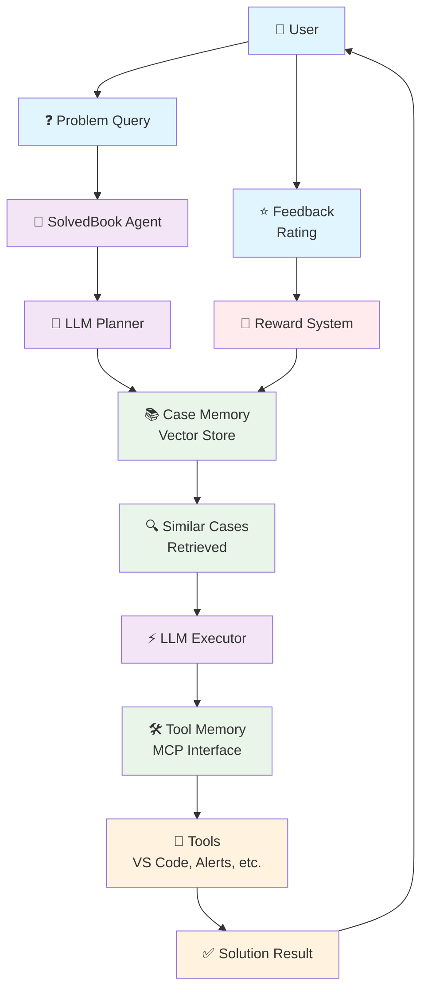
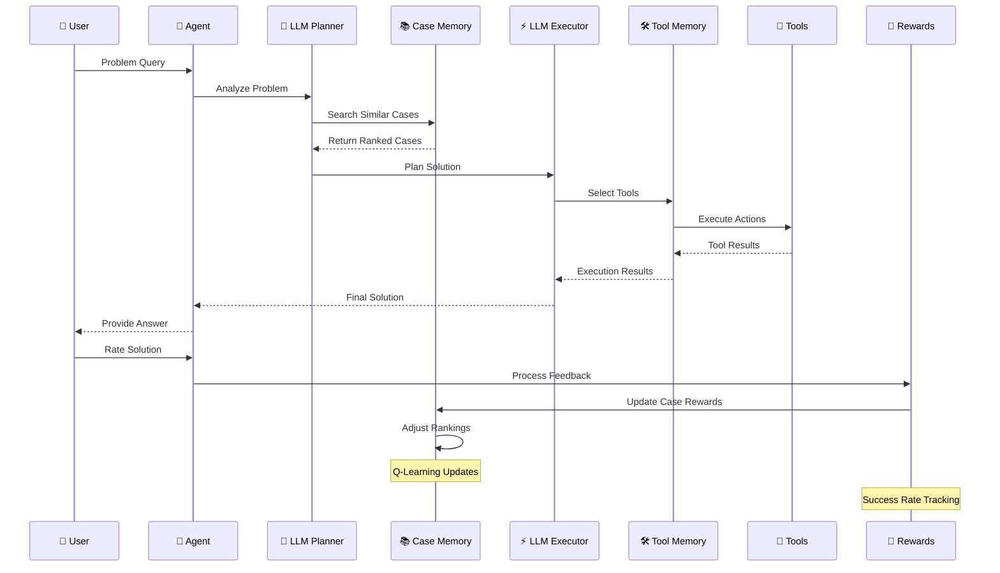
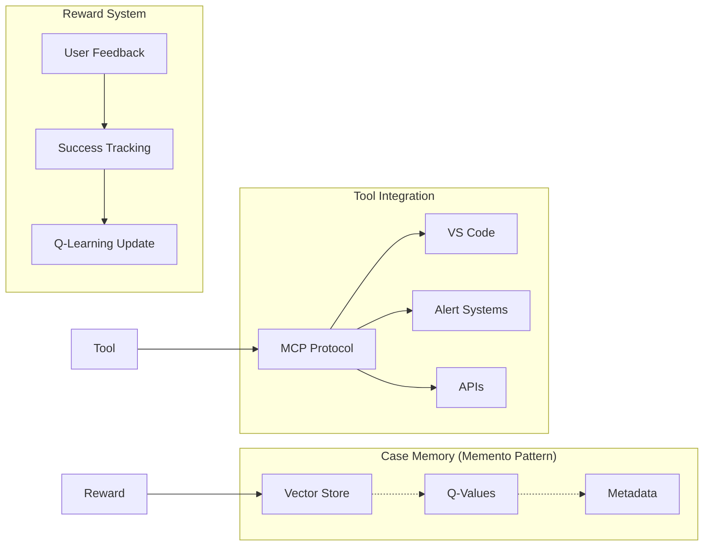
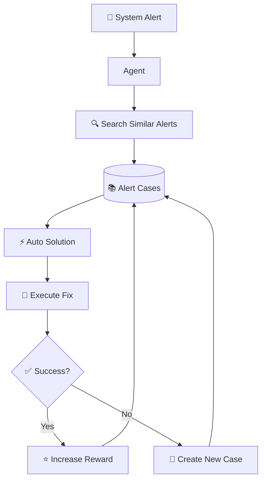
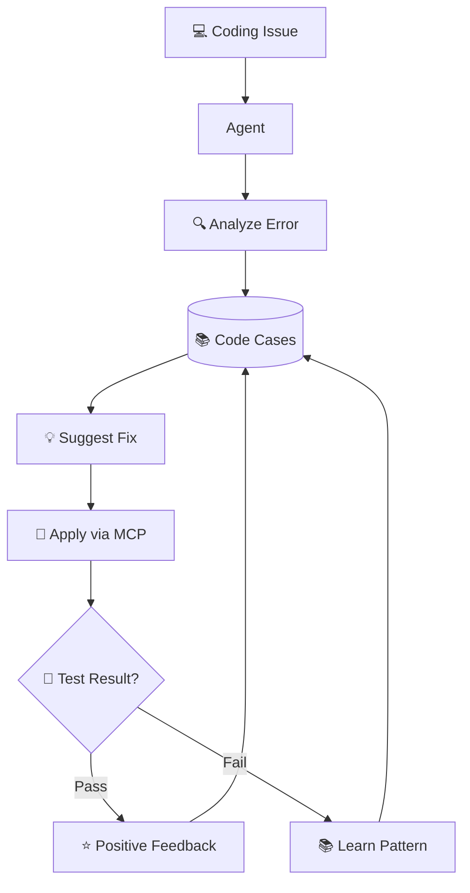
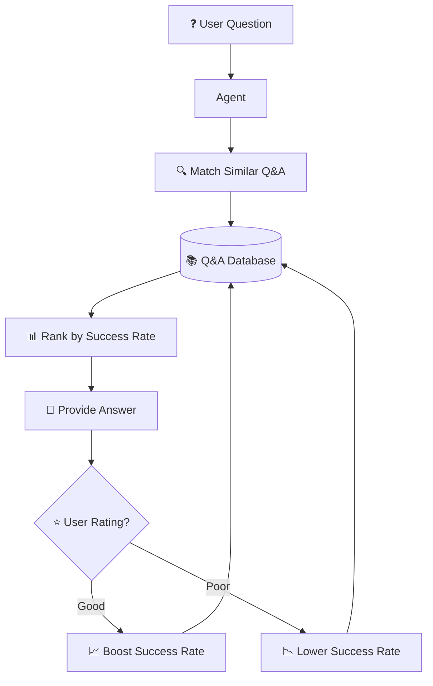

# SolvedBook Architecture Flow

```mermaid
graph TD
    User[👤 User] --> Query[❓ Problem Query]
    Query --> Agent[🤖 SolvedBook Agent]
    
    Agent --> Planner[🧠 LLM Planner]
    Planner --> CaseMemory[📚 Case Memory<br/>Vector Store]
    
    CaseMemory --> SimilarCases[🔍 Similar Cases<br/>Retrieved]
    SimilarCases --> Executor[⚡ LLM Executor]
    
    Executor --> ToolMemory[🛠️ Tool Memory<br/>MCP Interface]
    ToolMemory --> Tools[🔧 Tools<br/>VS Code, Alerts, etc.]
    
    Tools --> Result[✅ Solution Result]
    Result --> User
    
    User --> Feedback[⭐ Feedback<br/>Rating]
    Feedback --> Rewards[🎯 Reward System]
    Rewards --> CaseMemory
    
    %% Styling
    classDef userClass fill:#e1f5fe
    classDef agentClass fill:#f3e5f5
    classDef memoryClass fill:#e8f5e8
    classDef toolClass fill:#fff3e0
    classDef rewardClass fill:#ffebee
    
    class User,Query,Feedback userClass
    class Agent,Planner,Executor agentClass
    class CaseMemory,SimilarCases,ToolMemory memoryClass
    class Tools,Result toolClass
    class Rewards rewardClass
```

## Detailed Flow

```mermaid
sequenceDiagram
    participant U as 👤 User
    participant A as 🤖 Agent
    participant P as 🧠 LLM Planner
    participant CM as 📚 Case Memory
    participant E as ⚡ LLM Executor
    participant TM as 🛠️ Tool Memory
    participant T as 🔧 Tools
    participant R as 🎯 Rewards
    
    U->>A: Problem Query
    A->>P: Analyze Problem
    P->>CM: Search Similar Cases
    CM-->>P: Return Ranked Cases
    P->>E: Plan Solution
    E->>TM: Select Tools
    TM->>T: Execute Actions
    T-->>TM: Tool Results
    TM-->>E: Execution Results
    E-->>A: Final Solution
    A-->>U: Provide Answer
    
    U->>A: Rate Solution
    A->>R: Process Feedback
    R->>CM: Update Case Rewards
    CM->>CM: Adjust Rankings
    
    Note over CM: Q-Learning Updates
    Note over R: Success Rate Tracking
```

## Component Details

```mermaid
graph LR
    subgraph "Case Memory (Memento Pattern)"
        V[Vector Store]
        Q[Q-Values]
        M[Metadata]
        V -.-> Q
        Q -.-> M
    end
    
    subgraph "Reward System"
        F[User Feedback]
        S[Success Tracking]
        L[Q-Learning Update]
        F --> S
        S --> L
    end
    
    subgraph "Tool Integration"
        MCP[MCP Protocol]
        VS[VS Code]
        AL[Alert Systems]
        API[APIs]
        MCP --> VS
        MCP --> AL
        MCP --> API
    end
    
    Reward --> V
    Tool --> MCP
```

## Use Case Flows

### 1. Alert Management

```mermaid
flowchart TD
    Alert[🚨 System Alert] --> Agent
    Agent --> Search[🔍 Search Similar Alerts]
    Search --> Memory[(📚 Alert Cases)]
    Memory --> Solution[⚡ Auto Solution]
    Solution --> Execute[🔧 Execute Fix]
    Execute --> Success{✅ Success?}
    Success -->|Yes| UpdateReward[⭐ Increase Reward]
    Success -->|No| NewCase[📝 Create New Case]
    UpdateReward --> Memory
    NewCase --> Memory
```

### 2. Coding Assistant

```mermaid
flowchart TD
    Code[💻 Coding Issue] --> Agent
    Agent --> Analyze[🔍 Analyze Error]
    Analyze --> Memory[(📚 Code Cases)]
    Memory --> Suggest[💡 Suggest Fix]
    Suggest --> Apply[🔧 Apply via MCP]
    Apply --> Test{🧪 Test Result?}
    Test -->|Pass| Reward[⭐ Positive Feedback]
    Test -->|Fail| Learn[📚 Learn Pattern]
    Reward --> Memory
    Learn --> Memory
```

### 3. Q&A System

```mermaid
flowchart TD
    Question[❓ User Question] --> Agent
    Agent --> Match[🔍 Match Similar Q&A]
    Match --> Memory[(📚 Q&A Database)]
    Memory --> Rank[📊 Rank by Success Rate]
    Rank --> Answer[💬 Provide Answer]
    Answer --> Rate{⭐ User Rating?}
    Rate -->|Good| Boost[📈 Boost Success Rate]
    Rate -->|Poor| Lower[📉 Lower Success Rate]
    Boost --> Memory
    Lower --> Memory
```
